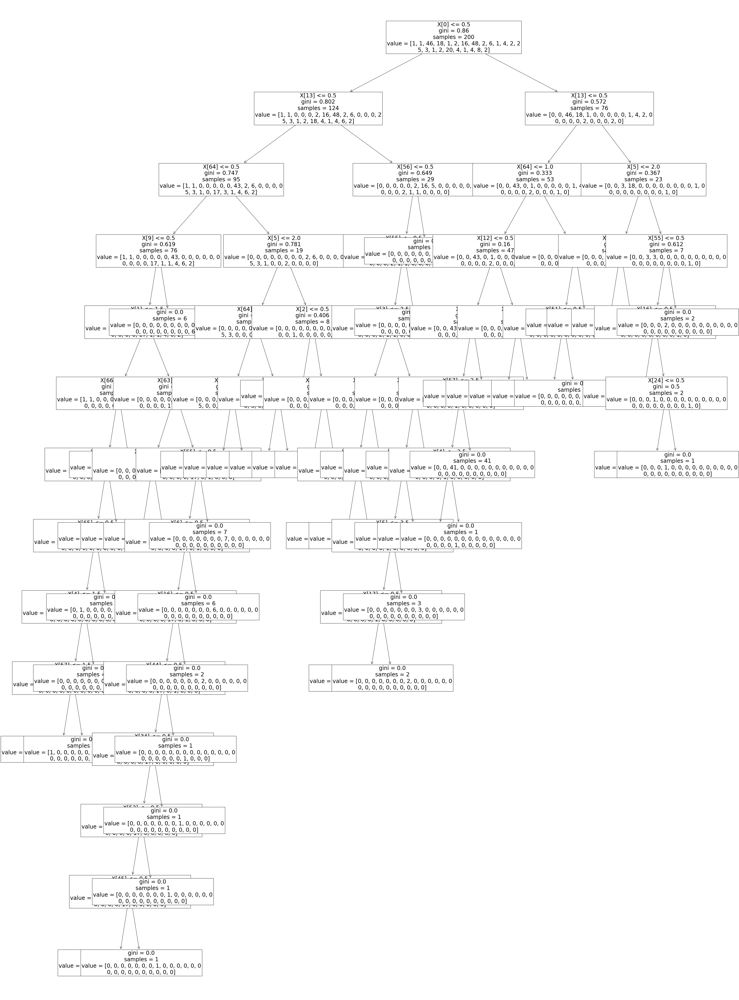

```python
import pandas as pd
import matplotlib.pyplot as plt
from sklearn.model_selection import train_test_split
from io import StringIO
from sklearn.preprocessing import LabelEncoder
import numpy as np
import seaborn as sns

```


```python
audio = pd.read_csv('audiology2.csv',header=0,sep=',')
audio.columns
df=audio
```


```python

df=df.drop("number_row",axis = 1)
var_mod = ['age_gt_60','airBoneGap','boneAbnormal','history_buzzing','history_dizziness',
       'history_fluctuating', 'history_fullness', 'history_heredity',
       'history_nausea', 'history_noise', 'history_recruitment',
       'history_ringing', 'history_roaring', 'history_vomiting',
       'late_wave_poor', 'm_at_2k', 'm_cond_lt_1k', 'm_gt_1k', 'm_m_gt_2k',
       'm_m_sn', 'm_m_sn_gt_1k', 'm_m_sn_gt_2k', 'm_m_sn_gt_500',
       'm_p_sn_gt_2k', 'm_s_gt_500', 'm_s_sn', 'm_s_sn_gt_1k', 'm_s_sn_gt_2k',
       'm_s_sn_gt_3k', 'm_s_sn_gt_4k', 'm_sn_2_3k', 'm_sn_gt_1k', 'm_sn_gt_2k',
       'm_sn_gt_3k', 'm_sn_gt_4k', 'm_sn_gt_500', 'm_sn_gt_6k', 'm_sn_lt_1k',
       'm_sn_lt_2k', 'm_sn_lt_3k', 'middle_wave_poor', 'mod_gt_4k',
       'mod_mixed', 'mod_s_mixed', 'mod_s_sn_gt_500', 'mod_sn', 'mod_sn_gt_1k',
       'mod_sn_gt_2k', 'mod_sn_gt_3k', 'mod_sn_gt_4k', 'mod_sn_gt_500',
       'notch_4k', 'notch_at_4k', 's_sn_gt_1k',
       's_sn_gt_2k', 's_sn_gt_4k', 'static_normal','viith_nerve_signs',
      'wave_V_delayed', 'waveform_ItoV_prolonged']

le = LabelEncoder()

for i in var_mod:

    df[i] = le.fit_transform(df[i])

df.head(10)
```


<div>
<style scoped>
    .dataframe tbody tr th:only-of-type {
        vertical-align: middle;
    }

    .dataframe tbody tr th {
        vertical-align: top;
    }

    .dataframe thead th {
        text-align: right;
    }
</style>
<table border="1" class="dataframe">
  <thead>
    <tr style="text-align: right;">
      <th></th>
      <th>age_gt_60</th>
      <th>air()</th>
      <th>airBoneGap</th>
      <th>ar_c()</th>
      <th>ar_u()</th>
      <th>bone()</th>
      <th>boneAbnormal</th>
      <th>bser()</th>
      <th>history_buzzing</th>
      <th>history_dizziness</th>
      <th>...</th>
      <th>s_sn_gt_1k</th>
      <th>s_sn_gt_2k</th>
      <th>s_sn_gt_4k</th>
      <th>speech()</th>
      <th>static_normal</th>
      <th>tymp()</th>
      <th>viith_nerve_signs</th>
      <th>wave_V_delayed</th>
      <th>waveform_ItoV_prolonged</th>
      <th>classification</th>
    </tr>
  </thead>
  <tbody>
    <tr>
      <th>0</th>
      <td>0</td>
      <td>moderate</td>
      <td>0</td>
      <td>normal</td>
      <td>normal</td>
      <td>?</td>
      <td>1</td>
      <td>?</td>
      <td>0</td>
      <td>0</td>
      <td>...</td>
      <td>0</td>
      <td>0</td>
      <td>0</td>
      <td>normal</td>
      <td>1</td>
      <td>a</td>
      <td>0</td>
      <td>0</td>
      <td>0</td>
      <td>cochlear_unknown</td>
    </tr>
    <tr>
      <th>1</th>
      <td>1</td>
      <td>mild</td>
      <td>1</td>
      <td>?</td>
      <td>absent</td>
      <td>mild</td>
      <td>1</td>
      <td>?</td>
      <td>0</td>
      <td>0</td>
      <td>...</td>
      <td>0</td>
      <td>0</td>
      <td>0</td>
      <td>normal</td>
      <td>1</td>
      <td>as</td>
      <td>0</td>
      <td>0</td>
      <td>0</td>
      <td>mixed_cochlear_age_fixation</td>
    </tr>
    <tr>
      <th>2</th>
      <td>1</td>
      <td>mild</td>
      <td>1</td>
      <td>?</td>
      <td>absent</td>
      <td>mild</td>
      <td>0</td>
      <td>?</td>
      <td>0</td>
      <td>0</td>
      <td>...</td>
      <td>0</td>
      <td>0</td>
      <td>0</td>
      <td>normal</td>
      <td>1</td>
      <td>b</td>
      <td>0</td>
      <td>0</td>
      <td>0</td>
      <td>mixed_cochlear_age_otitis_media</td>
    </tr>
    <tr>
      <th>3</th>
      <td>1</td>
      <td>mild</td>
      <td>0</td>
      <td>normal</td>
      <td>normal</td>
      <td>mild</td>
      <td>1</td>
      <td>?</td>
      <td>0</td>
      <td>0</td>
      <td>...</td>
      <td>0</td>
      <td>0</td>
      <td>0</td>
      <td>good</td>
      <td>1</td>
      <td>a</td>
      <td>0</td>
      <td>0</td>
      <td>0</td>
      <td>cochlear_age</td>
    </tr>
    <tr>
      <th>4</th>
      <td>1</td>
      <td>mild</td>
      <td>0</td>
      <td>normal</td>
      <td>normal</td>
      <td>mild</td>
      <td>1</td>
      <td>?</td>
      <td>0</td>
      <td>0</td>
      <td>...</td>
      <td>0</td>
      <td>0</td>
      <td>0</td>
      <td>very_good</td>
      <td>1</td>
      <td>a</td>
      <td>0</td>
      <td>0</td>
      <td>0</td>
      <td>cochlear_age</td>
    </tr>
    <tr>
      <th>5</th>
      <td>0</td>
      <td>mild</td>
      <td>0</td>
      <td>normal</td>
      <td>normal</td>
      <td>mild</td>
      <td>1</td>
      <td>?</td>
      <td>0</td>
      <td>0</td>
      <td>...</td>
      <td>0</td>
      <td>0</td>
      <td>0</td>
      <td>good</td>
      <td>1</td>
      <td>a</td>
      <td>0</td>
      <td>0</td>
      <td>0</td>
      <td>cochlear_unknown</td>
    </tr>
    <tr>
      <th>6</th>
      <td>0</td>
      <td>mild</td>
      <td>0</td>
      <td>normal</td>
      <td>normal</td>
      <td>mild</td>
      <td>1</td>
      <td>?</td>
      <td>0</td>
      <td>0</td>
      <td>...</td>
      <td>0</td>
      <td>0</td>
      <td>0</td>
      <td>very_good</td>
      <td>1</td>
      <td>a</td>
      <td>0</td>
      <td>0</td>
      <td>0</td>
      <td>cochlear_unknown</td>
    </tr>
    <tr>
      <th>7</th>
      <td>0</td>
      <td>severe</td>
      <td>0</td>
      <td>?</td>
      <td>?</td>
      <td>?</td>
      <td>1</td>
      <td>?</td>
      <td>0</td>
      <td>0</td>
      <td>...</td>
      <td>0</td>
      <td>0</td>
      <td>0</td>
      <td>?</td>
      <td>1</td>
      <td>a</td>
      <td>0</td>
      <td>0</td>
      <td>0</td>
      <td>cochlear_unknown</td>
    </tr>
    <tr>
      <th>8</th>
      <td>1</td>
      <td>mild</td>
      <td>0</td>
      <td>elevated</td>
      <td>absent</td>
      <td>mild</td>
      <td>1</td>
      <td>?</td>
      <td>0</td>
      <td>0</td>
      <td>...</td>
      <td>0</td>
      <td>0</td>
      <td>0</td>
      <td>good</td>
      <td>1</td>
      <td>a</td>
      <td>0</td>
      <td>0</td>
      <td>0</td>
      <td>cochlear_age</td>
    </tr>
    <tr>
      <th>9</th>
      <td>1</td>
      <td>mild</td>
      <td>0</td>
      <td>normal</td>
      <td>absent</td>
      <td>mild</td>
      <td>1</td>
      <td>?</td>
      <td>0</td>
      <td>0</td>
      <td>...</td>
      <td>0</td>
      <td>0</td>
      <td>0</td>
      <td>very_good</td>
      <td>1</td>
      <td>a</td>
      <td>0</td>
      <td>0</td>
      <td>0</td>
      <td>cochlear_age</td>
    </tr>
  </tbody>
</table>
<p>10 rows × 70 columns</p>
</div>


```python
df.info()
```

    <class 'pandas.core.frame.DataFrame'>
    RangeIndex: 200 entries, 0 to 199
    Data columns (total 70 columns):
     #   Column                   Non-Null Count  Dtype 
    ---  ------                   --------------  ----- 
     0   age_gt_60                200 non-null    int32 
     1   air()                    200 non-null    object
     2   airBoneGap               200 non-null    int32 
     3   ar_c()                   200 non-null    object
     4   ar_u()                   200 non-null    object
     5   bone()                   200 non-null    object
     6   boneAbnormal             200 non-null    int32 
     7   bser()                   200 non-null    object
     8   history_buzzing          200 non-null    int32 
     9   history_dizziness        200 non-null    int32 
     10  history_fluctuating      200 non-null    int32 
     11  history_fullness         200 non-null    int32 
     12  history_heredity         200 non-null    int32 
     13  history_nausea           200 non-null    int32 
     14  history_noise            200 non-null    int32 
     15  history_recruitment      200 non-null    int32 
     16  history_ringing          200 non-null    int32 
     17  history_roaring          200 non-null    int32 
     18  history_vomiting         200 non-null    int32 
     19  late_wave_poor           200 non-null    int32 
     20  m_at_2k                  200 non-null    int32 
     21  m_cond_lt_1k             200 non-null    int32 
     22  m_gt_1k                  200 non-null    int32 
     23  m_m_gt_2k                200 non-null    int32 
     24  m_m_sn                   200 non-null    int32 
     25  m_m_sn_gt_1k             200 non-null    int32 
     26  m_m_sn_gt_2k             200 non-null    int32 
     27  m_m_sn_gt_500            200 non-null    int32 
     28  m_p_sn_gt_2k             200 non-null    int32 
     29  m_s_gt_500               200 non-null    int32 
     30  m_s_sn                   200 non-null    int32 
     31  m_s_sn_gt_1k             200 non-null    int32 
     32  m_s_sn_gt_2k             200 non-null    int32 
     33  m_s_sn_gt_3k             200 non-null    int32 
     34  m_s_sn_gt_4k             200 non-null    int32 
     35  m_sn_2_3k                200 non-null    int32 
     36  m_sn_gt_1k               200 non-null    int32 
     37  m_sn_gt_2k               200 non-null    int32 
     38  m_sn_gt_3k               200 non-null    int32 
     39  m_sn_gt_4k               200 non-null    int32 
     40  m_sn_gt_500              200 non-null    int32 
     41  m_sn_gt_6k               200 non-null    int32 
     42  m_sn_lt_1k               200 non-null    int32 
     43  m_sn_lt_2k               200 non-null    int32 
     44  m_sn_lt_3k               200 non-null    int32 
     45  middle_wave_poor         200 non-null    int32 
     46  mod_gt_4k                200 non-null    int32 
     47  mod_mixed                200 non-null    int32 
     48  mod_s_mixed              200 non-null    int32 
     49  mod_s_sn_gt_500          200 non-null    int32 
     50  mod_sn                   200 non-null    int32 
     51  mod_sn_gt_1k             200 non-null    int32 
     52  mod_sn_gt_2k             200 non-null    int32 
     53  mod_sn_gt_3k             200 non-null    int32 
     54  mod_sn_gt_4k             200 non-null    int32 
     55  mod_sn_gt_500            200 non-null    int32 
     56  notch_4k                 200 non-null    int32 
     57  notch_at_4k              200 non-null    int32 
     58  o_ar_c()                 200 non-null    object
     59  o_ar_u()                 200 non-null    object
     60  s_sn_gt_1k               200 non-null    int32 
     61  s_sn_gt_2k               200 non-null    int32 
     62  s_sn_gt_4k               200 non-null    int32 
     63  speech()                 200 non-null    object
     64  static_normal            200 non-null    int32 
     65  tymp()                   200 non-null    object
     66  viith_nerve_signs        200 non-null    int32 
     67  wave_V_delayed           200 non-null    int32 
     68  waveform_ItoV_prolonged  200 non-null    int32 
     69  classification           200 non-null    object
    dtypes: int32(60), object(10)
    memory usage: 62.6+ KB
    


```python
df['speech()'].value_counts()
```


    normal        83
    good          36
    very_good     35
    poor          19
    very_poor     18
    ?              6
    unmeasured     3
    Name: speech(), dtype: int64


```python
le = LabelEncoder()
data_cat=df['speech()']
data_cat_encoded= le.fit_transform(data_cat)
data_cat_encoded= pd.DataFrame(data_cat_encoded,columns=["speech()"])
df['speech()']=data_cat_encoded
df['speech()'].value_counts()
```


    2    83
    1    36
    5    35
    3    19
    6    18
    0     6
    4     3
    Name: speech(), dtype: int64


```python
df['air()'].value_counts()
```


    mild        101
    normal       73
    moderate     17
    severe        8
    profound      1
    Name: air(), dtype: int64


```python
le = LabelEncoder()
data_cat=df['air()']
data_cat_encoded= le.fit_transform(data_cat)
data_cat_encoded= pd.DataFrame(data_cat_encoded,columns=['air()'])
df['air()']=data_cat_encoded
df['air()'].value_counts()
```


    0    101
    2     73
    1     17
    4      8
    3      1
    Name: air(), dtype: int64


```python
df['ar_c()'].value_counts()
```


    normal      117
    absent       50
    elevated     29
    ?             4
    Name: ar_c(), dtype: int64


```python
le = LabelEncoder()
data_cat=df['ar_c()']
data_cat_encoded= le.fit_transform(data_cat)
data_cat_encoded= pd.DataFrame(data_cat_encoded,columns=['ar_c()'])
df['ar_c()']=data_cat_encoded
df['ar_c()'].value_counts()
```


    3    117
    1     50
    2     29
    0      4
    Name: ar_c(), dtype: int64


```python
le = LabelEncoder()
data_cat=df['ar_u()']
data_cat_encoded= le.fit_transform(data_cat)
data_cat_encoded= pd.DataFrame(data_cat_encoded,columns=['ar_u()'])
df['ar_u()']=data_cat_encoded
df['ar_u()'].value_counts()
```


    3    121
    1     41
    2     35
    0      3
    Name: ar_u(), dtype: int64


```python
df['bone()'].value_counts()
```


    ?             75
    mild          55
    normal        37
    unmeasured    30
    moderate       3
    Name: bone(), dtype: int64


```python
le = LabelEncoder()
data_cat=df['bone()']
data_cat_encoded= le.fit_transform(data_cat)
data_cat_encoded= pd.DataFrame(data_cat_encoded,columns=['bone()'])
df['bone()']=data_cat_encoded
df['bone()'].value_counts()
```


    0    75
    1    55
    3    37
    4    30
    2     3
    Name: bone(), dtype: int64


```python
df['bser()'].value_counts()
```


    ?           196
    degraded      2
    normal        2
    Name: bser(), dtype: int64


```python
le = LabelEncoder()
data_cat=df['bser()']
data_cat_encoded= le.fit_transform(data_cat)
data_cat_encoded= pd.DataFrame(data_cat_encoded,columns=['bser()'])
df['bser()']=data_cat_encoded
df['bser()'].value_counts()
```


    0    196
    2      2
    1      2
    Name: bser(), dtype: int64


```python
df['o_ar_c()'].value_counts()
le = LabelEncoder()
data_cat=df['o_ar_c()']
data_cat_encoded= le.fit_transform(data_cat)
data_cat_encoded= pd.DataFrame(data_cat_encoded,columns=['o_ar_c()'])
df['o_ar_c()']=data_cat_encoded
df['o_ar_c()'].value_counts()
```


    3    124
    1     47
    2     24
    0      5
    Name: o_ar_c(), dtype: int64


```python
df['o_ar_u()'].value_counts()
le = LabelEncoder()
data_cat=df['o_ar_u()']
data_cat_encoded= le.fit_transform(data_cat)
data_cat_encoded= pd.DataFrame(data_cat_encoded,columns=['o_ar_u()'])
df['o_ar_u()']=data_cat_encoded
df['o_ar_u()'].value_counts()
```


    3    114
    1     47
    2     37
    0      2
    Name: o_ar_u(), dtype: int64


```python
df['tymp()'].value_counts()
le = LabelEncoder()
data_cat=df['tymp()']
data_cat_encoded= le.fit_transform(data_cat)
data_cat_encoded= pd.DataFrame(data_cat_encoded,columns=['tymp()'])
df['tymp()']=data_cat_encoded
df['tymp()'].value_counts()
```


    0    169
    2     12
    3      8
    4      7
    1      4
    Name: tymp(), dtype: int64


```python
df['tymp()'].value_counts()
```


    0    169
    2     12
    3      8
    4      7
    1      4
    Name: tymp(), dtype: int64


```python

le = LabelEncoder()
data_cat=df['tymp()']
data_cat_encoded= le.fit_transform(data_cat)
data_cat_encoded= pd.DataFrame(data_cat_encoded,columns=['tymp()'])
df['tymp()']=data_cat_encoded
df['tymp()'].value_counts()
```


    0    169
    2     12
    3      8
    4      7
    1      4
    Name: tymp(), dtype: int64


```python
df.info()
```

    <class 'pandas.core.frame.DataFrame'>
    RangeIndex: 200 entries, 0 to 199
    Data columns (total 70 columns):
     #   Column                   Non-Null Count  Dtype 
    ---  ------                   --------------  ----- 
     0   age_gt_60                200 non-null    int32 
     1   air()                    200 non-null    int32 
     2   airBoneGap               200 non-null    int32 
     3   ar_c()                   200 non-null    int32 
     4   ar_u()                   200 non-null    int32 
     5   bone()                   200 non-null    int32 
     6   boneAbnormal             200 non-null    int32 
     7   bser()                   200 non-null    int32 
     8   history_buzzing          200 non-null    int32 
     9   history_dizziness        200 non-null    int32 
     10  history_fluctuating      200 non-null    int32 
     11  history_fullness         200 non-null    int32 
     12  history_heredity         200 non-null    int32 
     13  history_nausea           200 non-null    int32 
     14  history_noise            200 non-null    int32 
     15  history_recruitment      200 non-null    int32 
     16  history_ringing          200 non-null    int32 
     17  history_roaring          200 non-null    int32 
     18  history_vomiting         200 non-null    int32 
     19  late_wave_poor           200 non-null    int32 
     20  m_at_2k                  200 non-null    int32 
     21  m_cond_lt_1k             200 non-null    int32 
     22  m_gt_1k                  200 non-null    int32 
     23  m_m_gt_2k                200 non-null    int32 
     24  m_m_sn                   200 non-null    int32 
     25  m_m_sn_gt_1k             200 non-null    int32 
     26  m_m_sn_gt_2k             200 non-null    int32 
     27  m_m_sn_gt_500            200 non-null    int32 
     28  m_p_sn_gt_2k             200 non-null    int32 
     29  m_s_gt_500               200 non-null    int32 
     30  m_s_sn                   200 non-null    int32 
     31  m_s_sn_gt_1k             200 non-null    int32 
     32  m_s_sn_gt_2k             200 non-null    int32 
     33  m_s_sn_gt_3k             200 non-null    int32 
     34  m_s_sn_gt_4k             200 non-null    int32 
     35  m_sn_2_3k                200 non-null    int32 
     36  m_sn_gt_1k               200 non-null    int32 
     37  m_sn_gt_2k               200 non-null    int32 
     38  m_sn_gt_3k               200 non-null    int32 
     39  m_sn_gt_4k               200 non-null    int32 
     40  m_sn_gt_500              200 non-null    int32 
     41  m_sn_gt_6k               200 non-null    int32 
     42  m_sn_lt_1k               200 non-null    int32 
     43  m_sn_lt_2k               200 non-null    int32 
     44  m_sn_lt_3k               200 non-null    int32 
     45  middle_wave_poor         200 non-null    int32 
     46  mod_gt_4k                200 non-null    int32 
     47  mod_mixed                200 non-null    int32 
     48  mod_s_mixed              200 non-null    int32 
     49  mod_s_sn_gt_500          200 non-null    int32 
     50  mod_sn                   200 non-null    int32 
     51  mod_sn_gt_1k             200 non-null    int32 
     52  mod_sn_gt_2k             200 non-null    int32 
     53  mod_sn_gt_3k             200 non-null    int32 
     54  mod_sn_gt_4k             200 non-null    int32 
     55  mod_sn_gt_500            200 non-null    int32 
     56  notch_4k                 200 non-null    int32 
     57  notch_at_4k              200 non-null    int32 
     58  o_ar_c()                 200 non-null    int32 
     59  o_ar_u()                 200 non-null    int32 
     60  s_sn_gt_1k               200 non-null    int32 
     61  s_sn_gt_2k               200 non-null    int32 
     62  s_sn_gt_4k               200 non-null    int32 
     63  speech()                 200 non-null    int32 
     64  static_normal            200 non-null    int32 
     65  tymp()                   200 non-null    int64 
     66  viith_nerve_signs        200 non-null    int32 
     67  wave_V_delayed           200 non-null    int32 
     68  waveform_ItoV_prolonged  200 non-null    int32 
     69  classification           200 non-null    object
    dtypes: int32(68), int64(1), object(1)
    memory usage: 56.4+ KB
    


```python

le = LabelEncoder()
data_cat=df['classification']
data_cat_encoded= le.fit_transform(data_cat)
data_cat_encoded= pd.DataFrame(data_cat_encoded,columns=['classification'])
df['classification']=data_cat_encoded
df['classification'].value_counts()

```


    7     48
    2     46
    18    20
    3     18
    6     16
    22     8
    9      6
    14     5
    11     4
    21     4
    19     4
    15     3
    5      2
    8      2
    23     2
    12     2
    13     2
    17     2
    10     1
    16     1
    4      1
    20     1
    1      1
    0      1
    Name: classification, dtype: int64


```python
df_label=df["classification"].copy()

```


```python
df=df.drop("bser()",axis = 1)
```


```python
from sklearn.preprocessing import StandardScaler

#feature_scal = StandardScaler()
#df = pd.DataFrame(feature_scal.fit_transform(df), columns=df.columns)
#df.head()
y=df.classification
x = df.drop(columns=['classification'])
```


```python
df=df.drop("classification",axis = 1)
median = df['mod_sn'].median()
df['mod_sn'].fillna(median)
df.head(50)

```


<div>
<style scoped>
    .dataframe tbody tr th:only-of-type {
        vertical-align: middle;
    }

    .dataframe tbody tr th {
        vertical-align: top;
    }

    .dataframe thead th {
        text-align: right;
    }
</style>
<table border="1" class="dataframe">
  <thead>
    <tr style="text-align: right;">
      <th></th>
      <th>age_gt_60</th>
      <th>air()</th>
      <th>airBoneGap</th>
      <th>ar_c()</th>
      <th>ar_u()</th>
      <th>bone()</th>
      <th>boneAbnormal</th>
      <th>history_buzzing</th>
      <th>history_dizziness</th>
      <th>history_fluctuating</th>
      <th>...</th>
      <th>o_ar_u()</th>
      <th>s_sn_gt_1k</th>
      <th>s_sn_gt_2k</th>
      <th>s_sn_gt_4k</th>
      <th>speech()</th>
      <th>static_normal</th>
      <th>tymp()</th>
      <th>viith_nerve_signs</th>
      <th>wave_V_delayed</th>
      <th>waveform_ItoV_prolonged</th>
    </tr>
  </thead>
  <tbody>
    <tr>
      <th>0</th>
      <td>0</td>
      <td>1</td>
      <td>0</td>
      <td>3</td>
      <td>3</td>
      <td>0</td>
      <td>1</td>
      <td>0</td>
      <td>0</td>
      <td>0</td>
      <td>...</td>
      <td>3</td>
      <td>0</td>
      <td>0</td>
      <td>0</td>
      <td>2</td>
      <td>1</td>
      <td>0</td>
      <td>0</td>
      <td>0</td>
      <td>0</td>
    </tr>
    <tr>
      <th>1</th>
      <td>1</td>
      <td>0</td>
      <td>1</td>
      <td>0</td>
      <td>1</td>
      <td>1</td>
      <td>1</td>
      <td>0</td>
      <td>0</td>
      <td>0</td>
      <td>...</td>
      <td>1</td>
      <td>0</td>
      <td>0</td>
      <td>0</td>
      <td>2</td>
      <td>1</td>
      <td>2</td>
      <td>0</td>
      <td>0</td>
      <td>0</td>
    </tr>
    <tr>
      <th>2</th>
      <td>1</td>
      <td>0</td>
      <td>1</td>
      <td>0</td>
      <td>1</td>
      <td>1</td>
      <td>0</td>
      <td>0</td>
      <td>0</td>
      <td>0</td>
      <td>...</td>
      <td>1</td>
      <td>0</td>
      <td>0</td>
      <td>0</td>
      <td>2</td>
      <td>1</td>
      <td>3</td>
      <td>0</td>
      <td>0</td>
      <td>0</td>
    </tr>
    <tr>
      <th>3</th>
      <td>1</td>
      <td>0</td>
      <td>0</td>
      <td>3</td>
      <td>3</td>
      <td>1</td>
      <td>1</td>
      <td>0</td>
      <td>0</td>
      <td>0</td>
      <td>...</td>
      <td>3</td>
      <td>0</td>
      <td>0</td>
      <td>0</td>
      <td>1</td>
      <td>1</td>
      <td>0</td>
      <td>0</td>
      <td>0</td>
      <td>0</td>
    </tr>
    <tr>
      <th>4</th>
      <td>1</td>
      <td>0</td>
      <td>0</td>
      <td>3</td>
      <td>3</td>
      <td>1</td>
      <td>1</td>
      <td>0</td>
      <td>0</td>
      <td>0</td>
      <td>...</td>
      <td>3</td>
      <td>0</td>
      <td>0</td>
      <td>0</td>
      <td>5</td>
      <td>1</td>
      <td>0</td>
      <td>0</td>
      <td>0</td>
      <td>0</td>
    </tr>
    <tr>
      <th>5</th>
      <td>0</td>
      <td>0</td>
      <td>0</td>
      <td>3</td>
      <td>3</td>
      <td>1</td>
      <td>1</td>
      <td>0</td>
      <td>0</td>
      <td>0</td>
      <td>...</td>
      <td>3</td>
      <td>0</td>
      <td>0</td>
      <td>0</td>
      <td>1</td>
      <td>1</td>
      <td>0</td>
      <td>0</td>
      <td>0</td>
      <td>0</td>
    </tr>
    <tr>
      <th>6</th>
      <td>0</td>
      <td>0</td>
      <td>0</td>
      <td>3</td>
      <td>3</td>
      <td>1</td>
      <td>1</td>
      <td>0</td>
      <td>0</td>
      <td>0</td>
      <td>...</td>
      <td>3</td>
      <td>0</td>
      <td>0</td>
      <td>0</td>
      <td>5</td>
      <td>1</td>
      <td>0</td>
      <td>0</td>
      <td>0</td>
      <td>0</td>
    </tr>
    <tr>
      <th>7</th>
      <td>0</td>
      <td>4</td>
      <td>0</td>
      <td>0</td>
      <td>0</td>
      <td>0</td>
      <td>1</td>
      <td>0</td>
      <td>0</td>
      <td>0</td>
      <td>...</td>
      <td>0</td>
      <td>0</td>
      <td>0</td>
      <td>0</td>
      <td>0</td>
      <td>1</td>
      <td>0</td>
      <td>0</td>
      <td>0</td>
      <td>0</td>
    </tr>
    <tr>
      <th>8</th>
      <td>1</td>
      <td>0</td>
      <td>0</td>
      <td>2</td>
      <td>1</td>
      <td>1</td>
      <td>1</td>
      <td>0</td>
      <td>0</td>
      <td>0</td>
      <td>...</td>
      <td>1</td>
      <td>0</td>
      <td>0</td>
      <td>0</td>
      <td>1</td>
      <td>1</td>
      <td>0</td>
      <td>0</td>
      <td>0</td>
      <td>0</td>
    </tr>
    <tr>
      <th>9</th>
      <td>1</td>
      <td>0</td>
      <td>0</td>
      <td>3</td>
      <td>1</td>
      <td>1</td>
      <td>1</td>
      <td>0</td>
      <td>0</td>
      <td>0</td>
      <td>...</td>
      <td>1</td>
      <td>0</td>
      <td>0</td>
      <td>0</td>
      <td>5</td>
      <td>1</td>
      <td>0</td>
      <td>0</td>
      <td>0</td>
      <td>0</td>
    </tr>
    <tr>
      <th>10</th>
      <td>1</td>
      <td>0</td>
      <td>0</td>
      <td>3</td>
      <td>3</td>
      <td>0</td>
      <td>1</td>
      <td>0</td>
      <td>0</td>
      <td>0</td>
      <td>...</td>
      <td>3</td>
      <td>0</td>
      <td>0</td>
      <td>0</td>
      <td>1</td>
      <td>1</td>
      <td>0</td>
      <td>0</td>
      <td>0</td>
      <td>0</td>
    </tr>
    <tr>
      <th>11</th>
      <td>0</td>
      <td>4</td>
      <td>0</td>
      <td>3</td>
      <td>3</td>
      <td>2</td>
      <td>1</td>
      <td>0</td>
      <td>0</td>
      <td>0</td>
      <td>...</td>
      <td>3</td>
      <td>0</td>
      <td>0</td>
      <td>0</td>
      <td>6</td>
      <td>1</td>
      <td>0</td>
      <td>0</td>
      <td>0</td>
      <td>0</td>
    </tr>
    <tr>
      <th>12</th>
      <td>0</td>
      <td>2</td>
      <td>0</td>
      <td>2</td>
      <td>3</td>
      <td>1</td>
      <td>0</td>
      <td>0</td>
      <td>0</td>
      <td>0</td>
      <td>...</td>
      <td>2</td>
      <td>0</td>
      <td>0</td>
      <td>0</td>
      <td>2</td>
      <td>1</td>
      <td>0</td>
      <td>0</td>
      <td>0</td>
      <td>0</td>
    </tr>
    <tr>
      <th>13</th>
      <td>1</td>
      <td>0</td>
      <td>0</td>
      <td>3</td>
      <td>3</td>
      <td>1</td>
      <td>1</td>
      <td>0</td>
      <td>0</td>
      <td>0</td>
      <td>...</td>
      <td>2</td>
      <td>0</td>
      <td>0</td>
      <td>0</td>
      <td>5</td>
      <td>1</td>
      <td>0</td>
      <td>0</td>
      <td>0</td>
      <td>0</td>
    </tr>
    <tr>
      <th>14</th>
      <td>1</td>
      <td>0</td>
      <td>0</td>
      <td>3</td>
      <td>2</td>
      <td>1</td>
      <td>1</td>
      <td>0</td>
      <td>0</td>
      <td>0</td>
      <td>...</td>
      <td>2</td>
      <td>0</td>
      <td>0</td>
      <td>0</td>
      <td>1</td>
      <td>1</td>
      <td>0</td>
      <td>0</td>
      <td>0</td>
      <td>0</td>
    </tr>
    <tr>
      <th>15</th>
      <td>0</td>
      <td>0</td>
      <td>0</td>
      <td>3</td>
      <td>3</td>
      <td>1</td>
      <td>1</td>
      <td>0</td>
      <td>0</td>
      <td>0</td>
      <td>...</td>
      <td>2</td>
      <td>0</td>
      <td>0</td>
      <td>0</td>
      <td>5</td>
      <td>1</td>
      <td>0</td>
      <td>0</td>
      <td>0</td>
      <td>0</td>
    </tr>
    <tr>
      <th>16</th>
      <td>0</td>
      <td>0</td>
      <td>0</td>
      <td>3</td>
      <td>2</td>
      <td>1</td>
      <td>1</td>
      <td>0</td>
      <td>0</td>
      <td>0</td>
      <td>...</td>
      <td>3</td>
      <td>0</td>
      <td>0</td>
      <td>0</td>
      <td>2</td>
      <td>1</td>
      <td>0</td>
      <td>0</td>
      <td>0</td>
      <td>0</td>
    </tr>
    <tr>
      <th>17</th>
      <td>0</td>
      <td>2</td>
      <td>0</td>
      <td>3</td>
      <td>3</td>
      <td>0</td>
      <td>0</td>
      <td>0</td>
      <td>0</td>
      <td>0</td>
      <td>...</td>
      <td>2</td>
      <td>0</td>
      <td>0</td>
      <td>0</td>
      <td>2</td>
      <td>1</td>
      <td>0</td>
      <td>0</td>
      <td>0</td>
      <td>0</td>
    </tr>
    <tr>
      <th>18</th>
      <td>0</td>
      <td>2</td>
      <td>0</td>
      <td>3</td>
      <td>2</td>
      <td>0</td>
      <td>0</td>
      <td>0</td>
      <td>0</td>
      <td>0</td>
      <td>...</td>
      <td>3</td>
      <td>0</td>
      <td>0</td>
      <td>0</td>
      <td>2</td>
      <td>1</td>
      <td>0</td>
      <td>0</td>
      <td>0</td>
      <td>0</td>
    </tr>
    <tr>
      <th>19</th>
      <td>1</td>
      <td>0</td>
      <td>0</td>
      <td>3</td>
      <td>3</td>
      <td>0</td>
      <td>1</td>
      <td>0</td>
      <td>0</td>
      <td>0</td>
      <td>...</td>
      <td>3</td>
      <td>1</td>
      <td>0</td>
      <td>0</td>
      <td>6</td>
      <td>1</td>
      <td>0</td>
      <td>0</td>
      <td>0</td>
      <td>0</td>
    </tr>
    <tr>
      <th>20</th>
      <td>1</td>
      <td>0</td>
      <td>0</td>
      <td>3</td>
      <td>3</td>
      <td>0</td>
      <td>1</td>
      <td>0</td>
      <td>0</td>
      <td>0</td>
      <td>...</td>
      <td>3</td>
      <td>0</td>
      <td>1</td>
      <td>0</td>
      <td>2</td>
      <td>1</td>
      <td>0</td>
      <td>0</td>
      <td>0</td>
      <td>0</td>
    </tr>
    <tr>
      <th>21</th>
      <td>0</td>
      <td>2</td>
      <td>0</td>
      <td>3</td>
      <td>3</td>
      <td>0</td>
      <td>1</td>
      <td>0</td>
      <td>0</td>
      <td>0</td>
      <td>...</td>
      <td>3</td>
      <td>0</td>
      <td>1</td>
      <td>0</td>
      <td>1</td>
      <td>1</td>
      <td>0</td>
      <td>0</td>
      <td>0</td>
      <td>0</td>
    </tr>
    <tr>
      <th>22</th>
      <td>0</td>
      <td>2</td>
      <td>0</td>
      <td>3</td>
      <td>3</td>
      <td>3</td>
      <td>0</td>
      <td>0</td>
      <td>0</td>
      <td>0</td>
      <td>...</td>
      <td>3</td>
      <td>0</td>
      <td>0</td>
      <td>0</td>
      <td>2</td>
      <td>1</td>
      <td>0</td>
      <td>0</td>
      <td>0</td>
      <td>0</td>
    </tr>
    <tr>
      <th>23</th>
      <td>0</td>
      <td>1</td>
      <td>0</td>
      <td>2</td>
      <td>2</td>
      <td>0</td>
      <td>1</td>
      <td>0</td>
      <td>0</td>
      <td>0</td>
      <td>...</td>
      <td>3</td>
      <td>0</td>
      <td>0</td>
      <td>0</td>
      <td>6</td>
      <td>1</td>
      <td>0</td>
      <td>0</td>
      <td>0</td>
      <td>0</td>
    </tr>
    <tr>
      <th>24</th>
      <td>0</td>
      <td>2</td>
      <td>0</td>
      <td>3</td>
      <td>3</td>
      <td>3</td>
      <td>1</td>
      <td>0</td>
      <td>0</td>
      <td>0</td>
      <td>...</td>
      <td>2</td>
      <td>0</td>
      <td>0</td>
      <td>0</td>
      <td>5</td>
      <td>1</td>
      <td>0</td>
      <td>0</td>
      <td>0</td>
      <td>0</td>
    </tr>
    <tr>
      <th>25</th>
      <td>0</td>
      <td>2</td>
      <td>0</td>
      <td>3</td>
      <td>2</td>
      <td>3</td>
      <td>1</td>
      <td>0</td>
      <td>0</td>
      <td>0</td>
      <td>...</td>
      <td>3</td>
      <td>0</td>
      <td>0</td>
      <td>0</td>
      <td>5</td>
      <td>1</td>
      <td>0</td>
      <td>0</td>
      <td>0</td>
      <td>0</td>
    </tr>
    <tr>
      <th>26</th>
      <td>0</td>
      <td>0</td>
      <td>0</td>
      <td>3</td>
      <td>3</td>
      <td>0</td>
      <td>1</td>
      <td>0</td>
      <td>0</td>
      <td>0</td>
      <td>...</td>
      <td>3</td>
      <td>0</td>
      <td>0</td>
      <td>1</td>
      <td>2</td>
      <td>1</td>
      <td>0</td>
      <td>0</td>
      <td>0</td>
      <td>0</td>
    </tr>
    <tr>
      <th>27</th>
      <td>0</td>
      <td>0</td>
      <td>0</td>
      <td>1</td>
      <td>1</td>
      <td>1</td>
      <td>1</td>
      <td>0</td>
      <td>0</td>
      <td>0</td>
      <td>...</td>
      <td>3</td>
      <td>0</td>
      <td>0</td>
      <td>0</td>
      <td>6</td>
      <td>1</td>
      <td>0</td>
      <td>0</td>
      <td>0</td>
      <td>0</td>
    </tr>
    <tr>
      <th>28</th>
      <td>0</td>
      <td>0</td>
      <td>0</td>
      <td>2</td>
      <td>3</td>
      <td>1</td>
      <td>1</td>
      <td>0</td>
      <td>0</td>
      <td>0</td>
      <td>...</td>
      <td>1</td>
      <td>0</td>
      <td>0</td>
      <td>0</td>
      <td>2</td>
      <td>1</td>
      <td>0</td>
      <td>0</td>
      <td>0</td>
      <td>0</td>
    </tr>
    <tr>
      <th>29</th>
      <td>0</td>
      <td>0</td>
      <td>0</td>
      <td>3</td>
      <td>3</td>
      <td>0</td>
      <td>0</td>
      <td>0</td>
      <td>0</td>
      <td>0</td>
      <td>...</td>
      <td>3</td>
      <td>0</td>
      <td>0</td>
      <td>0</td>
      <td>2</td>
      <td>1</td>
      <td>0</td>
      <td>0</td>
      <td>0</td>
      <td>0</td>
    </tr>
    <tr>
      <th>30</th>
      <td>0</td>
      <td>2</td>
      <td>0</td>
      <td>2</td>
      <td>3</td>
      <td>0</td>
      <td>0</td>
      <td>0</td>
      <td>0</td>
      <td>0</td>
      <td>...</td>
      <td>3</td>
      <td>0</td>
      <td>0</td>
      <td>0</td>
      <td>2</td>
      <td>1</td>
      <td>0</td>
      <td>0</td>
      <td>0</td>
      <td>0</td>
    </tr>
    <tr>
      <th>31</th>
      <td>0</td>
      <td>2</td>
      <td>0</td>
      <td>3</td>
      <td>2</td>
      <td>0</td>
      <td>0</td>
      <td>0</td>
      <td>0</td>
      <td>0</td>
      <td>...</td>
      <td>3</td>
      <td>0</td>
      <td>0</td>
      <td>0</td>
      <td>1</td>
      <td>1</td>
      <td>0</td>
      <td>0</td>
      <td>0</td>
      <td>0</td>
    </tr>
    <tr>
      <th>32</th>
      <td>0</td>
      <td>2</td>
      <td>0</td>
      <td>2</td>
      <td>2</td>
      <td>0</td>
      <td>0</td>
      <td>0</td>
      <td>0</td>
      <td>0</td>
      <td>...</td>
      <td>3</td>
      <td>0</td>
      <td>0</td>
      <td>0</td>
      <td>1</td>
      <td>1</td>
      <td>0</td>
      <td>0</td>
      <td>0</td>
      <td>0</td>
    </tr>
    <tr>
      <th>33</th>
      <td>0</td>
      <td>1</td>
      <td>1</td>
      <td>1</td>
      <td>1</td>
      <td>1</td>
      <td>1</td>
      <td>0</td>
      <td>0</td>
      <td>0</td>
      <td>...</td>
      <td>3</td>
      <td>0</td>
      <td>0</td>
      <td>0</td>
      <td>5</td>
      <td>1</td>
      <td>3</td>
      <td>0</td>
      <td>0</td>
      <td>0</td>
    </tr>
    <tr>
      <th>34</th>
      <td>0</td>
      <td>0</td>
      <td>0</td>
      <td>1</td>
      <td>3</td>
      <td>1</td>
      <td>1</td>
      <td>0</td>
      <td>0</td>
      <td>0</td>
      <td>...</td>
      <td>1</td>
      <td>0</td>
      <td>0</td>
      <td>0</td>
      <td>2</td>
      <td>1</td>
      <td>0</td>
      <td>0</td>
      <td>0</td>
      <td>0</td>
    </tr>
    <tr>
      <th>35</th>
      <td>1</td>
      <td>0</td>
      <td>0</td>
      <td>1</td>
      <td>1</td>
      <td>1</td>
      <td>1</td>
      <td>0</td>
      <td>0</td>
      <td>0</td>
      <td>...</td>
      <td>1</td>
      <td>0</td>
      <td>0</td>
      <td>0</td>
      <td>5</td>
      <td>1</td>
      <td>0</td>
      <td>0</td>
      <td>0</td>
      <td>0</td>
    </tr>
    <tr>
      <th>36</th>
      <td>0</td>
      <td>2</td>
      <td>0</td>
      <td>1</td>
      <td>2</td>
      <td>3</td>
      <td>0</td>
      <td>0</td>
      <td>0</td>
      <td>0</td>
      <td>...</td>
      <td>1</td>
      <td>0</td>
      <td>0</td>
      <td>0</td>
      <td>2</td>
      <td>1</td>
      <td>0</td>
      <td>0</td>
      <td>0</td>
      <td>0</td>
    </tr>
    <tr>
      <th>37</th>
      <td>0</td>
      <td>4</td>
      <td>1</td>
      <td>1</td>
      <td>1</td>
      <td>1</td>
      <td>0</td>
      <td>0</td>
      <td>0</td>
      <td>0</td>
      <td>...</td>
      <td>2</td>
      <td>0</td>
      <td>0</td>
      <td>0</td>
      <td>6</td>
      <td>1</td>
      <td>1</td>
      <td>0</td>
      <td>0</td>
      <td>0</td>
    </tr>
    <tr>
      <th>38</th>
      <td>1</td>
      <td>2</td>
      <td>0</td>
      <td>3</td>
      <td>3</td>
      <td>0</td>
      <td>0</td>
      <td>0</td>
      <td>0</td>
      <td>0</td>
      <td>...</td>
      <td>2</td>
      <td>0</td>
      <td>0</td>
      <td>0</td>
      <td>1</td>
      <td>1</td>
      <td>0</td>
      <td>0</td>
      <td>0</td>
      <td>0</td>
    </tr>
    <tr>
      <th>39</th>
      <td>1</td>
      <td>2</td>
      <td>0</td>
      <td>2</td>
      <td>3</td>
      <td>0</td>
      <td>0</td>
      <td>0</td>
      <td>0</td>
      <td>0</td>
      <td>...</td>
      <td>3</td>
      <td>0</td>
      <td>0</td>
      <td>0</td>
      <td>5</td>
      <td>1</td>
      <td>0</td>
      <td>0</td>
      <td>0</td>
      <td>0</td>
    </tr>
    <tr>
      <th>40</th>
      <td>0</td>
      <td>2</td>
      <td>0</td>
      <td>3</td>
      <td>2</td>
      <td>3</td>
      <td>0</td>
      <td>0</td>
      <td>0</td>
      <td>0</td>
      <td>...</td>
      <td>1</td>
      <td>0</td>
      <td>0</td>
      <td>0</td>
      <td>2</td>
      <td>1</td>
      <td>0</td>
      <td>0</td>
      <td>0</td>
      <td>0</td>
    </tr>
    <tr>
      <th>41</th>
      <td>1</td>
      <td>0</td>
      <td>0</td>
      <td>3</td>
      <td>3</td>
      <td>0</td>
      <td>0</td>
      <td>0</td>
      <td>0</td>
      <td>0</td>
      <td>...</td>
      <td>3</td>
      <td>0</td>
      <td>0</td>
      <td>0</td>
      <td>2</td>
      <td>1</td>
      <td>0</td>
      <td>0</td>
      <td>0</td>
      <td>0</td>
    </tr>
    <tr>
      <th>42</th>
      <td>0</td>
      <td>0</td>
      <td>0</td>
      <td>2</td>
      <td>3</td>
      <td>0</td>
      <td>0</td>
      <td>0</td>
      <td>0</td>
      <td>0</td>
      <td>...</td>
      <td>2</td>
      <td>0</td>
      <td>0</td>
      <td>0</td>
      <td>2</td>
      <td>1</td>
      <td>0</td>
      <td>0</td>
      <td>0</td>
      <td>0</td>
    </tr>
    <tr>
      <th>43</th>
      <td>0</td>
      <td>0</td>
      <td>0</td>
      <td>2</td>
      <td>2</td>
      <td>0</td>
      <td>0</td>
      <td>0</td>
      <td>0</td>
      <td>0</td>
      <td>...</td>
      <td>3</td>
      <td>0</td>
      <td>0</td>
      <td>0</td>
      <td>2</td>
      <td>1</td>
      <td>0</td>
      <td>0</td>
      <td>0</td>
      <td>0</td>
    </tr>
    <tr>
      <th>44</th>
      <td>0</td>
      <td>1</td>
      <td>0</td>
      <td>1</td>
      <td>1</td>
      <td>2</td>
      <td>1</td>
      <td>1</td>
      <td>0</td>
      <td>0</td>
      <td>...</td>
      <td>2</td>
      <td>0</td>
      <td>0</td>
      <td>0</td>
      <td>6</td>
      <td>1</td>
      <td>0</td>
      <td>0</td>
      <td>1</td>
      <td>0</td>
    </tr>
    <tr>
      <th>45</th>
      <td>0</td>
      <td>0</td>
      <td>1</td>
      <td>1</td>
      <td>1</td>
      <td>3</td>
      <td>0</td>
      <td>0</td>
      <td>0</td>
      <td>0</td>
      <td>...</td>
      <td>1</td>
      <td>0</td>
      <td>0</td>
      <td>0</td>
      <td>0</td>
      <td>1</td>
      <td>2</td>
      <td>0</td>
      <td>0</td>
      <td>0</td>
    </tr>
    <tr>
      <th>46</th>
      <td>0</td>
      <td>0</td>
      <td>0</td>
      <td>1</td>
      <td>1</td>
      <td>1</td>
      <td>1</td>
      <td>0</td>
      <td>0</td>
      <td>0</td>
      <td>...</td>
      <td>2</td>
      <td>0</td>
      <td>0</td>
      <td>0</td>
      <td>2</td>
      <td>1</td>
      <td>0</td>
      <td>0</td>
      <td>0</td>
      <td>0</td>
    </tr>
    <tr>
      <th>47</th>
      <td>0</td>
      <td>2</td>
      <td>0</td>
      <td>1</td>
      <td>2</td>
      <td>3</td>
      <td>0</td>
      <td>0</td>
      <td>0</td>
      <td>0</td>
      <td>...</td>
      <td>1</td>
      <td>0</td>
      <td>0</td>
      <td>0</td>
      <td>2</td>
      <td>1</td>
      <td>0</td>
      <td>0</td>
      <td>0</td>
      <td>0</td>
    </tr>
    <tr>
      <th>48</th>
      <td>1</td>
      <td>1</td>
      <td>0</td>
      <td>3</td>
      <td>3</td>
      <td>0</td>
      <td>0</td>
      <td>0</td>
      <td>0</td>
      <td>0</td>
      <td>...</td>
      <td>2</td>
      <td>0</td>
      <td>1</td>
      <td>0</td>
      <td>6</td>
      <td>0</td>
      <td>0</td>
      <td>0</td>
      <td>0</td>
      <td>0</td>
    </tr>
    <tr>
      <th>49</th>
      <td>1</td>
      <td>1</td>
      <td>0</td>
      <td>3</td>
      <td>2</td>
      <td>0</td>
      <td>0</td>
      <td>0</td>
      <td>0</td>
      <td>0</td>
      <td>...</td>
      <td>3</td>
      <td>0</td>
      <td>1</td>
      <td>0</td>
      <td>6</td>
      <td>0</td>
      <td>0</td>
      <td>0</td>
      <td>0</td>
      <td>0</td>
    </tr>
  </tbody>
</table>
<p>50 rows × 68 columns</p>
</div>


```python
x_train,x_test,y_train,y_test =  train_test_split(x,y,test_size=0.4,random_state=400)

```


```python
from sklearn.tree import DecisionTreeClassifier
from sklearn import metrics
from sklearn import preprocessing
from sklearn.metrics import accuracy_score
from sklearn.metrics import classification_report
clft=DecisionTreeClassifier()
clft=clft.fit(x_train,y_train)
y_predt = clft.predict(x_test)


from sklearn import tree
plt.figure(figsize=(50,80))
temp = tree.plot_tree(clft.fit(x,y),fontsize=24)
plt.show()
```





```python
from sklearn.naive_bayes import GaussianNB
clfb = GaussianNB()
clfb.fit(x_train,y_train.ravel())
y_predb = clfb.predict(x_test)
print(classification_report(y_test,clfb.predict(x_test)))

```

                  precision    recall  f1-score   support
    
               2       0.95      0.91      0.93        22
               3       0.80      0.80      0.80        10
               6       1.00      1.00      1.00         4
               7       0.86      0.75      0.80        16
               9       1.00      1.00      1.00         4
              11       0.25      1.00      0.40         1
              14       1.00      0.67      0.80         3
              15       1.00      1.00      1.00         1
              17       1.00      1.00      1.00         1
              18       0.80      0.80      0.80        10
              19       0.00      0.00      0.00         3
              21       0.00      0.00      0.00         2
              22       0.33      1.00      0.50         3
    
        accuracy                           0.80        80
       macro avg       0.69      0.76      0.69        80
    weighted avg       0.81      0.80      0.79        80
    
    

    C:\Users\Amirshnll\anaconda3\lib\site-packages\sklearn\metrics\_classification.py:1221: UndefinedMetricWarning: Precision and F-score are ill-defined and being set to 0.0 in labels with no predicted samples. Use `zero_division` parameter to control this behavior.
      _warn_prf(average, modifier, msg_start, len(result))
    


```python
from sklearn.neighbors import KNeighborsClassifier
k=1
clfk= KNeighborsClassifier(n_neighbors=k)
clfk.fit(x_train,y_train.ravel())
y_predk=clfk.predict(x_test)
print("when k = {} neighbors , knn test acuracy : {}" .format(k,clfk.score(x_test,y_test)))
print("when k = {} neighbors , knn test acuracy : {}" .format(k,clfk.score(x_train,y_train))) 
print(classification_report(y_test,clfk.predict(x_test)))
ran = np.arange(1,30)
train_list = []
test_list = []
for i,each in enumerate(ran):
    clfk= KNeighborsClassifier(n_neighbors=each)
    clfk.fit(x_train,y_train.ravel())
    
```

    when k = 1 neighbors , knn test acuracy : 0.6125
    when k = 1 neighbors , knn test acuracy : 1.0
                  precision    recall  f1-score   support
    
               2       0.71      0.91      0.80        22
               3       1.00      0.50      0.67        10
               6       0.33      0.50      0.40         4
               7       0.44      0.50      0.47        16
               8       0.00      0.00      0.00         0
               9       1.00      0.75      0.86         4
              11       0.50      1.00      0.67         1
              14       0.60      1.00      0.75         3
              15       0.00      0.00      0.00         1
              17       1.00      1.00      1.00         1
              18       0.50      0.50      0.50        10
              19       0.00      0.00      0.00         3
              21       0.00      0.00      0.00         2
              22       1.00      0.33      0.50         3
    
        accuracy                           0.61        80
       macro avg       0.51      0.50      0.47        80
    weighted avg       0.62      0.61      0.59        80
    
    

    C:\Users\Amirshnll\anaconda3\lib\site-packages\sklearn\metrics\_classification.py:1221: UndefinedMetricWarning: Precision and F-score are ill-defined and being set to 0.0 in labels with no predicted samples. Use `zero_division` parameter to control this behavior.
      _warn_prf(average, modifier, msg_start, len(result))
    C:\Users\Amirshnll\anaconda3\lib\site-packages\sklearn\metrics\_classification.py:1221: UndefinedMetricWarning: Recall and F-score are ill-defined and being set to 0.0 in labels with no true samples. Use `zero_division` parameter to control this behavior.
      _warn_prf(average, modifier, msg_start, len(result))
    


```python
from sklearn.neural_network import MLPClassifier
clfm = MLPClassifier(hidden_layer_sizes=(5,),max_iter=1500)
clfm.fit(x_train,y_train.ravel())
y_predm = clfm.predict(x_test)
print ("acuracy:", metrics.accuracy_score (y_test,y_predm))
```

    acuracy: 0.7625
    

    C:\Users\Amirshnll\anaconda3\lib\site-packages\sklearn\neural_network\_multilayer_perceptron.py:582: ConvergenceWarning: Stochastic Optimizer: Maximum iterations (1500) reached and the optimization hasn't converged yet.
      warnings.warn(
    


```python

```
